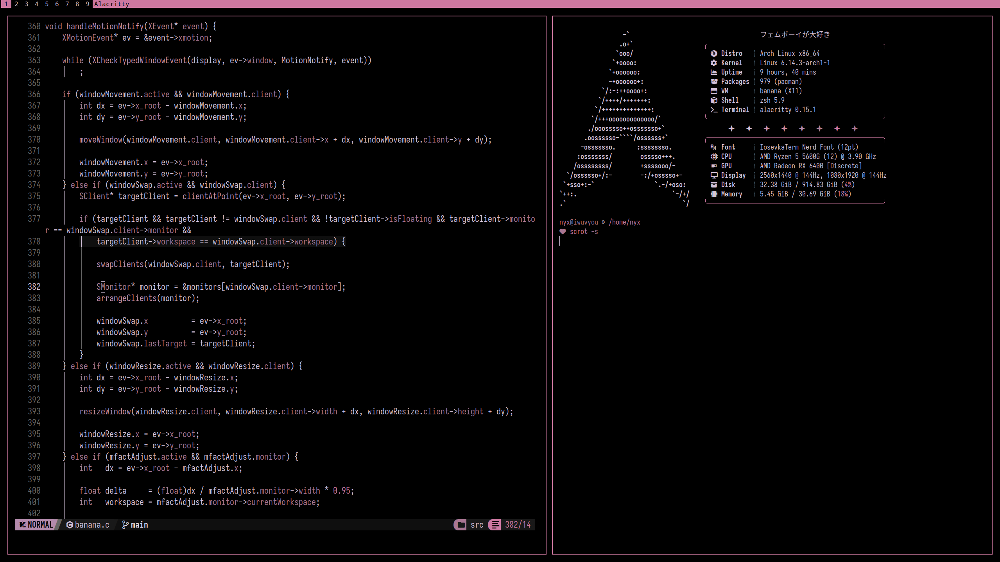

<div align="center">

# banana



A minimal window manager

</div>

## building

This should be self explanatory but if you don't know how then run this to build & install.

```bash
make release; sudo make install
```

Make sure you have the necessary dependencies installed.

## releases

Releases / tags are currently not being pushed out as banana is not production ready, and/or
reasonably complete. Releases will be pushed out when the project becomes more mature, and
grows over time.

## configuration

Configuration is done at `$HOME/.config/banana/banana.conf`, this file will be automatically
created if it doesn't exist, all available configuration options exist in this file already.
All options are self explanatory and don't need documentation, if you can't figure it out,
then this window manager might not be for you.

Changes to the config file do not require a restart, but changes are not applied immediately,
to apply changes use `alt+r` or whatever you have `reload_config` set to in the config
file.

By default the terminal specified in the config file is set to `alacritty` the keybind to
launch it is `alt+q`. Make sure you have `alacritty` installed, or just change it before
launching.

## compositing

By default banana doesn't have rounded corners, opacity, animations, and all of that junk
baked in, you will have to use what is known as a compositor e.g. `picom`.

## ewmh docks

As of right now there is no support for docks, only the built in bar is supported. In the
future I would like to implement it, but for right now the baked in bar is enough, and plenty
scriptable via xsetroot. Use something like `slstatus`.